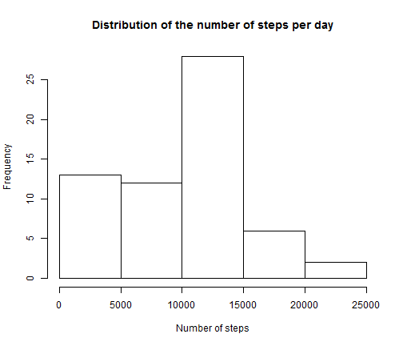
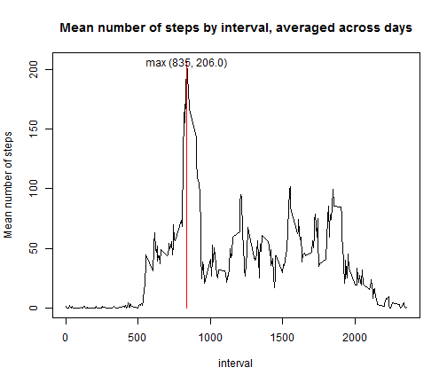
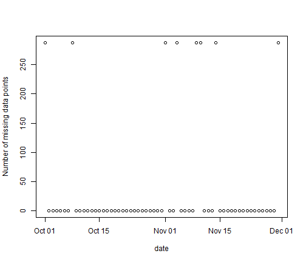

Reproducible Research - Peer Assessment 1
=========================================

# Synopsis
This report is a submission for the Peer Assessment #1 for the Coursera Data Science specialization, Reproducible Research course.  In this assignment, we look at the data from an activity measuring device used by a particular individual over a period of two months. This particular device measures the number of steps taken within 5 minute intervals throughout the day.

# Loading and Processing the Raw Data

The data for this assignment is available on the Coursera course site  [Activity monitoring data (52k)](https://d396qusza40orc.cloudfront.net/repdata%2Fdata%2Factivity.zip), along with the [instructions and additional background](https://class.coursera.org/repdata-002/human_grading/view/courses/972084/assessments/3/submissions) from which the following explanation is excerpted.

[Excerpt from assignment instructions]

The variables included in this dataset are:
- steps: Number of steps taking in a 5-minute interval (missing values are coded as NA)

- date: The date on which the measurement was taken in YYYY-MM-DD format

- interval: Identifier for the 5-minute interval in which measurement was taken

The dataset is stored in a comma-separated-value (CSV) file and there are a total of 17,568 observations in this dataset.


## Reading in the data

```r
rawdata <- read.csv("project/data/activity.csv")
rawdata$date = as.Date(rawdata$date)

head(rawdata)
```

```
##   steps       date interval
## 1    NA 2012-10-01        0
## 2    NA 2012-10-01        5
## 3    NA 2012-10-01       10
## 4    NA 2012-10-01       15
## 5    NA 2012-10-01       20
## 6    NA 2012-10-01       25
```


# Assignment questions

## Q1: What is mean total number of steps taken per day?

For this question, missing values are ignored (as per assignment instructions).


```r
library(plyr)
byDay <- ddply(rawdata, .(date), summarize, sum = sum(steps, na.rm = T), mean = mean(steps, 
    na.rm = T), median = median(steps, na.rm = T), count = length(steps), nonZero = sum(!is.na(steps) & 
    steps != 0), zero = sum(!is.na(steps) & steps == 0), na = sum(is.na(steps)))

mean(byDay$sum)
```

```
## [1] 9354
```

```r
median(byDay$sum)
```

```
## [1] 10395
```


```r
hist(byDay$sum, main = "Distribution of the number of steps per day", xlab = "Number of steps")
```

 


## Q2: What is the average daily activity pattern?
1. Make a time series plot (i.e. type = "l") of the 5-minute interval (x-axis) and the average number of steps taken, averaged across all days (y-axis)

2. Which 5-minute interval, on average across all the days in the dataset, contains the maximum number of steps?

```r
byInterval <- ddply(rawdata, .(interval), summarize, sum = sum(steps, na.rm = T), 
    mean = mean(steps, na.rm = T), median = median(steps, na.rm = T), count = length(steps), 
    nonZero = sum(!is.na(steps) & steps != 0), zero = sum(steps == 0), na = sum(is.na(steps)))
tMax <- byInterval[which.max(byInterval$mean), 1]

tMax
```

```
## [1] 835
```


Here is a plot showing the average steps across days, with a vertical line marking the maximum.


```r
plot(byInterval$interval, byInterval$mean, type = "l", main = "Mean number of steps by interval, averaged across days", 
    xlab = "interval", ylab = "Mean number of steps")
lines(c(tMax, tMax), c(0, max(byInterval$mean)), type = "l", col = "red")
text(tMax, max(byInterval$mean), labels = c(sprintf("max (%d, %.1f)", tMax, 
    round(max(byInterval$mean)), 1)))
```

 


## Q3: Imputing missing values


```r
# missing values
sum(is.na(rawdata$steps))
```

```
## [1] 2304
```


By looking at the data, we see that most days have no missing data, and the rest have no data.

```r
with(byDay, plot(date, na, ylab = "Number of missing data points"), main = "Missing data points per day")
```

 


Without other knowledge, a reasonable estimation for each missing interval's data is the mean for that interval.

```r
processedData <- data.frame(rawdata)

for (i in 1:nrow(byInterval)) {
    processedData$steps[is.na(processedData$steps) & processedData$interval == 
        byInterval$interval[i]] = byInterval$mean[i]
}
```


After the imputation, the mean and median are higher, and equal to one another. The histogram shows a smoother distribution.


```r
byDay2 <- ddply(processedData, .(date), summarize, sum = sum(steps, na.rm = T), 
    mean = mean(steps, na.rm = T), median = median(steps, na.rm = T), count = length(steps), 
    nonZero = sum(steps != 0), zero = sum(steps == 0), na = sum(is.na(steps)))

mean(byDay2$sum)
```

```
## [1] 10766
```

```r
median(byDay2$sum)
```

```
## [1] 10766
```


```r
hist(byDay2$sum, main = "Distribution of the number of steps per day (with imputed data)", 
    xlab = "Number of steps")
```

 


## Q4: Are there differences in activity patterns between weekdays and weekends?


```r
processedData$daytype = as.factor(ifelse(weekdays(processedData$date) %in% c("Saturday", 
    "Sunday"), "weekend", "weekday"))
byInterval2 <- ddply(processedData, .(daytype, interval), summarize, sum = sum(steps), 
    mean = mean(steps), median = median(steps))
```


By plotting the mean steps per interval separately for weekends and weekdays, it appears that the number of steps is spread more evenly on the weekends.


```r
library(lattice)
xyplot(mean ~ interval | daytype, data = byInterval2, type = "l", layout = c(1, 
    2), main = "Mean steps by interval, averaged across days (with imputed data)", 
    xlab = "interval", ylab = "Mean steps")
```

 


